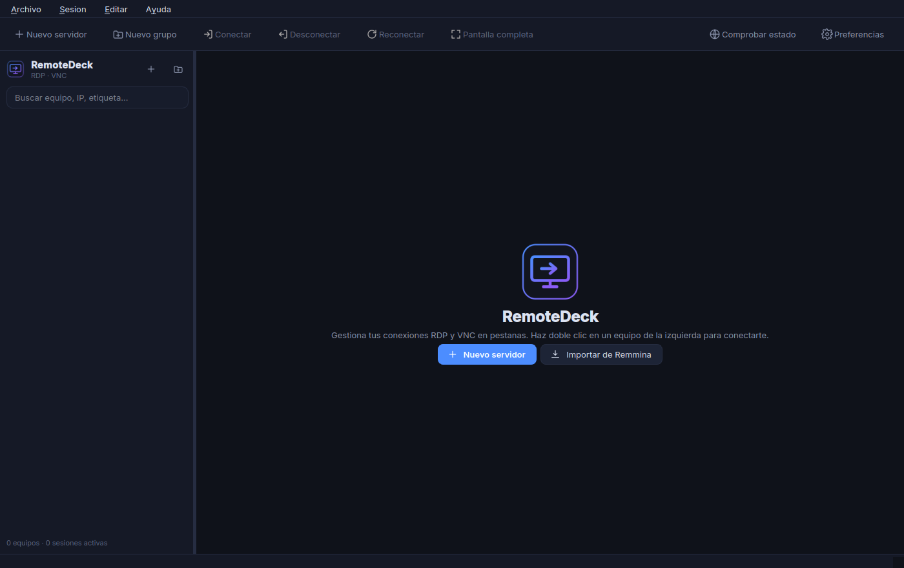

# RemoteDeck

Gestor de conexiones remotas para Linux al estilo del *Remote Desktop Connection
Manager* de Windows: el árbol de equipos a la izquierda, las sesiones **RDP** y
**VNC** embebidas en pestañas a la derecha, y todo en un único AppImage que no
instala nada.



## Qué hace

- **Grupos anidados con herencia de credenciales**. El usuario y la contraseña
  se cargan una vez en el grupo y los equipos de adentro los heredan. Arrastrar
  y soltar para reordenar.
- **Sesiones embebidas en pestañas**. A FreeRDP se le pasa `/parent-window` y la
  ventana del visor de TigerVNC se reparenta dentro de la pestaña, así que no
  terminás con quince ventanas sueltas en la barra de tareas. `F11` para
  pantalla completa, con una barra flotante para volver.
- **RDP completo**: NLA/TLS/RDP clásico, profundidad de color, resolución
  dinámica, portapapeles, audio, micrófono, unidades, impresoras, tarjetas
  inteligentes, multi-monitor, RD Gateway, distribución de teclado y argumentos
  extra.
- **VNC**: codificación, calidad, compresión, solo lectura, sesión compartida y
  redimensionado del escritorio remoto.
- **Wake-on-LAN por equipo**: MAC (con detección desde la tabla ARP), dirección
  de difusión, puerto y espera. Puede despertar el equipo automáticamente antes
  de conectarse y esperar a que el puerto responda.
- **Estado en vivo**: chequea el puerto de cada equipo y pinta el indicador en
  verde o rojo.
- **Importa de Remmina** (incluidas las contraseñas del llavero), de ficheros
  `.rdg` de RDCMan, de `.rdp` sueltos y de su propio JSON.
- **Credenciales cifradas** en disco, con contraseña maestra opcional. Nunca
  viajan por la línea de comandos.
- **Cuatro idiomas**: español (el principal), inglés, francés y alemán.
- Búsqueda incremental, favoritos, notas y etiquetas por equipo, tema oscuro o
  claro y color de acento configurable.

## Instalación

**[⬇ Descargar RemoteDeck-x86_64.AppImage](https://github.com/jeremiaspala/RemoteDeck/releases/latest/download/RemoteDeck-x86_64.AppImage)** (~134 MB)

```bash
chmod +x RemoteDeck-x86_64.AppImage
./RemoteDeck-x86_64.AppImage
```

Si tu sistema no tiene FUSE, ejecutalo con `--appimage-extract-and-run`.

Trae adentro Python 3.12, PyQt6, FreeRDP 3 y TigerVNC. No necesita permisos de
administrador ni instalar clientes remotos.

## Dependencias

**El AppImage** solo usa del sistema el stack gráfico habitual: glibc,
libstdc++, X11 (`libx11-6`, `libxcb1`, `libxext6`, `libxi6`, `libxrandr2`,
`libxfixes3`, `libxcursor1`), OpenGL (`libgl1`, `libegl1`), `libdbus-1-3`,
`libudev1` y, opcionalmente, `libpulse0` para el audio de las sesiones RDP. Las
bibliotecas que el plugin `xcb` de Qt suele echar en falta (`libxcb-cursor0` y
compañía) van empaquetadas adentro.

Necesita **X11 o XWayland**: el embebido de ventanas no existe en Wayland puro.
En sesiones Wayland la aplicación se fuerza sola a XCB.

**Desde el código**:

```bash
sudo apt install python3 python3-pyqt6 python3-pyqt6.qtsvg \
                 freerdp3-x11 tigervnc-viewer tigervnc-common
python3 run.py
```

Opcionales: `python3-gi` + `gir1.2-secret-1` para leer las contraseñas de
Remmina del llavero, e `iproute2` para detectar la MAC en Wake-on-LAN. No hay
dependencias de PyPI: el cifrado, el DES de VNC y el acceso a X11 están
resueltos con la biblioteca estándar y ctypes.

## Manual

El [manual completo](docs/MANUAL.md) cubre la instalación, las opciones de cada
protocolo, Wake-on-LAN, los importadores, el cifrado de credenciales y una
sección de problemas frecuentes.

Atajos principales:

| Atajo | Acción |
|---|---|
| Doble clic / `Enter` | Conectar |
| `F11` / `Esc` | Entrar y salir de pantalla completa |
| `Ctrl+R` | Reconectar |
| `Ctrl+W` | Cerrar la sesión activa |
| `Ctrl+N` / `Ctrl+Shift+N` | Nuevo servidor / grupo |
| `Ctrl+Shift+W` | Enviar Wake-on-LAN |
| `F5` | Comprobar el estado de los equipos |

## Construir el AppImage

```bash
bash packaging/build-appimage.sh
```

Descarga una base de CPython portable, instala PyQt6, recorta los módulos de Qt
que no se usan, copia la aplicación y empaqueta `xfreerdp3`, `vncviewer` y
`vncpasswd` con sus bibliotecas. Resultado: `RemoteDeck-x86_64.AppImage`
(~140 MB).

## Cómo funciona por dentro

- **RDP**: `xfreerdp3` con `/parent-window:<xid>`, apuntando a una ventana
  nativa de Qt. Los argumentos (contraseña incluida) se le pasan por `stdin`
  con `/args-from:stdin`, así no aparecen en `ps`.
- **VNC**: TigerVNC no tiene equivalente a `parent-window`, así que se busca la
  ventana del proceso por su `_NET_WM_PID` y se la reparenta con
  `XReparentWindow`. La contraseña va en un fichero 0600 en `$XDG_RUNTIME_DIR`
  que se borra al cerrar la sesión.
- **Cifrado**: scrypt para derivar la clave, flujo HMAC-SHA256 en modo contador
  para cifrar y HMAC-SHA256 para autenticar (cifrar-luego-autenticar). Todo con
  la biblioteca estándar, sin dependencias binarias.
- **X11**: `ctypes` sobre `libX11` para lo mínimo indispensable (buscar la
  ventana, reparentarla y redimensionarla).

## Créditos

Hecho por **Jeremías Palazzesi** — [Fundamenta](https://fundamenta.ar).

## Licencia

MIT.
